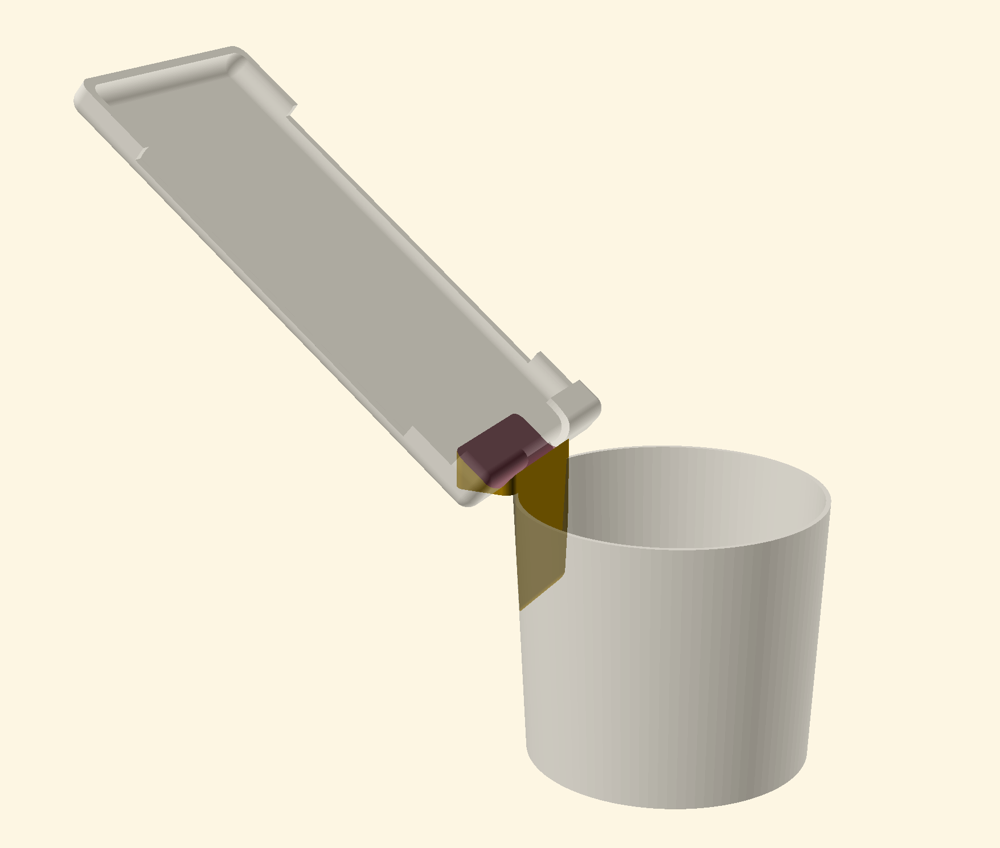
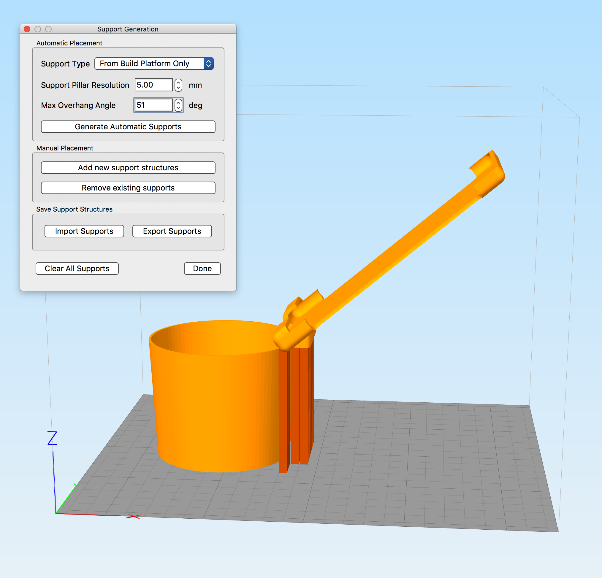

# OpenSCAD Tesla Model 3 Cup holder mount for iPhone X
_Pat Niemeyer (pat@pat.net), https://github.com/patniemeyer/phone-holder)

<table>
  <tr>
    <th>
      
    </th>
    <th>
      
    </th>
  </tr>
</table>

This is a simple OpenSCAD phone holder that mounts an iPhone X in a Tesla Model cup holder.

## Warning: 
The rubber lining of the cup holder and the plastic surface of the center console are easily scratched.
If you print this phone holder yourself please go over it with some sandpaper to remove any unexpected bumps or
rough spots before using it in your car!  

## Printing the parts 

The STL folder contains the STL cup-holder.stl file along with some other phone mounts from this project.

I was able to print this easily with only supports on the center connector area as shown here:

